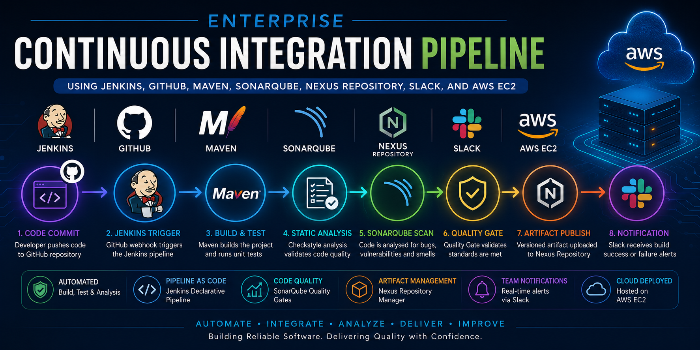
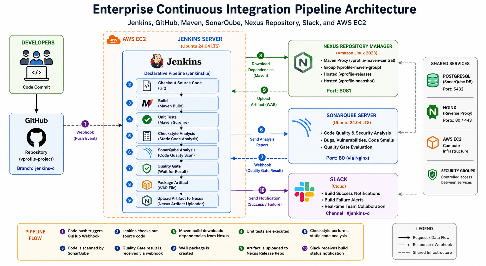

# Enterprise Continuous Integration Pipeline Using Jenkins, GitHub, Maven, SonarQube, Nexus Repository, Slack, and AWS EC2



## Project Overview

This project demonstrates the implementation of an enterprise-style Continuous Integration pipeline for a Java web application.

The pipeline is orchestrated by Jenkins and automatically starts whenever a developer pushes code changes to GitHub. It builds and tests the application, performs static code analysis, enforces SonarQube Quality Gates, publishes versioned artifacts to Nexus Repository Manager, and sends build notifications to Slack.

The complete pipeline is defined as code in a version-controlled `Jenkinsfile`.

---

## Objectives

The main objectives of this project are to:

* Automate application build and validation activities.
* Trigger Jenkins pipelines automatically from GitHub.
* Implement Pipeline as Code using a declarative Jenkinsfile.
* Build a Java application using Maven.
* Manage Maven dependencies through Nexus Repository Manager.
* Execute unit tests and Checkstyle analysis.
* Analyse code quality using SonarQube.
* Prevent poor-quality code from progressing through Quality Gates.
* Publish immutable, versioned build artifacts to Nexus.
* Notify development teams of pipeline results through Slack.
* Host the CI infrastructure on AWS EC2.

---

## Architecture



---

## CI Pipeline Workflow

The pipeline performs the following stages:

1. **Source Code Checkout**
   Jenkins retrieves the latest code and pipeline definition from GitHub.

2. **Build**
   Maven compiles and packages the application while retrieving dependencies through Nexus.

3. **Unit Testing**
   Automated unit tests are executed using Maven Surefire.

4. **Checkstyle Analysis**
   The source code is checked against defined Java coding standards.

5. **SonarQube Analysis**
   Source code, unit-test reports and static-analysis reports are published to SonarQube.

6. **Quality Gate**
   Jenkins waits for SonarQube to evaluate the project against the configured quality criteria.

7. **Artifact Publication**
   A uniquely versioned WAR artifact is uploaded to Nexus Repository Manager.

8. **Notification**
   Slack receives a colour-coded success or failure message containing the Jenkins build URL.

---

## Technologies Used

| Technology               | Purpose                                     |
| ------------------------ | ------------------------------------------- |
| Jenkins                  | Continuous Integration orchestration        |
| GitHub                   | Source code hosting and webhook integration |
| Git                      | Source code version control                 |
| Maven                    | Java build and dependency management        |
| SonarQube                | Code quality and security analysis          |
| Checkstyle               | Java static code analysis                   |
| Nexus Repository Manager | Dependency caching and artifact storage     |
| Slack                    | Pipeline notifications                      |
| AWS EC2                  | Hosting Jenkins, Nexus and SonarQube        |
| PostgreSQL               | SonarQube database                          |
| Nginx                    | Reverse proxy for SonarQube                 |
| Java                     | Application build and runtime dependency    |
| Linux                    | Server operating system                     |

---

## Repository Structure

```text
.
├── Jenkinsfile
├── settings.xml
├── pom.xml
├── src/
│   ├── main/
│   └── test/
├── user-data-scripts/
│   ├── jenkins-setup.sh
│   ├── nexus-setup.sh
│   └── sonar-setup.sh
└── README.md
```

### Important Files

| File               | Description                                            |
| ------------------ | ------------------------------------------------------ |
| `Jenkinsfile`      | Declarative CI pipeline definition                     |
| `settings.xml`     | Maven configuration for Nexus repositories             |
| `pom.xml`          | Maven project configuration                            |
| `jenkins-setup.sh` | Automates Jenkins installation                         |
| `nexus-setup.sh`   | Automates Nexus installation                           |
| `sonar-setup.sh`   | Automates SonarQube, PostgreSQL and Nginx installation |

---

## Prerequisites

Before deploying this project, ensure that you have:

* An AWS account.
* A GitHub account.
* A Slack workspace.
* Git installed locally.
* Git Bash, Linux terminal or macOS Terminal.
* Visual Studio Code or another code editor.
* Basic knowledge of AWS, Linux, Git, Jenkins and Maven.
* An EC2 SSH key pair.

---

## AWS Infrastructure

The project uses three EC2 instances.

| Server    | Recommended OS          | Minimum Instance Type | Default Port |
| --------- | ----------------------- | --------------------: | -----------: |
| Jenkins   | Ubuntu Server 24.04 LTS |            `t2.small` |         8080 |
| Nexus     | Amazon Linux 2023       |           `t2.medium` |         8081 |
| SonarQube | Ubuntu Server 24.04 LTS |           `t2.medium` |    80 / 9000 |

> Instance types may need to be increased depending on workload, plugins and concurrent builds.

---

## Security Group Configuration

### Jenkins Security Group

| Port | Source                  | Purpose                    |
| ---: | ----------------------- | -------------------------- |
|   22 | Administrator IP        | SSH access                 |
| 8080 | GitHub/required clients | Jenkins and webhook access |

### Nexus Security Group

| Port | Source                 | Purpose                           |
| ---: | ---------------------- | --------------------------------- |
|   22 | Administrator IP       | SSH access                        |
| 8081 | Administrator IP       | Nexus web interface               |
| 8081 | Jenkins security group | Dependencies and artifact uploads |

### SonarQube Security Group

| Port | Source                 | Purpose                 |
| ---: | ---------------------- | ----------------------- |
|   22 | Administrator IP       | SSH access              |
|   80 | Administrator IP       | SonarQube through Nginx |
|   80 | Jenkins security group | Analysis uploads        |
| 9000 | Restricted/optional    | Direct SonarQube access |

For production environments, avoid unrestricted public access. Use HTTPS, private subnets, load balancers and security-group references where appropriate.

---

## Deployment Steps

Detailed step-by-step deployment steps, configuration details, and workflow documentation are available in the [Setup Guide](./Setup-Guide.md).

### 1. Fork the Repository

Fork the source repository into your GitHub account.

Ensure all branches are copied and switch to:

```bash
git checkout jenkins-ci
```

---

### 2. Clone the Repository

```bash
git clone git@github.com:<your-username>/vprofile-project.git
cd vprofile-project
git checkout jenkins-ci
```

---

### 3. Configure Git Identity

```bash
git config --global user.name "Your Name"
git config --global user.email "your-email@example.com"
```

---

### 4. Launch the EC2 Instances

Launch the Jenkins, Nexus and SonarQube EC2 instances.

Paste the corresponding setup script into:

```text
EC2 Launch Instance
→ Advanced Details
→ User Data
```

Ensure every script begins with:

```bash
#!/bin/bash
```

Allow sufficient time for the services to install and start.

---

## Jenkins Configuration

### Initial Login

Open Jenkins:

```text
http://<jenkins-public-ip>:8080
```

Retrieve the initial administrator password:

```bash
sudo cat /var/lib/jenkins/secrets/initialAdminPassword
```

Install the suggested plugins and create an administrator account.

---

### Required Jenkins Plugins

Install the following plugins:

* Maven Integration
* GitHub Integration
* Nexus Artifact Uploader
* SonarQube Scanner
* Slack Notification
* Build Timestamp

Navigate to:

```text
Manage Jenkins
→ Plugins
→ Available Plugins
```

---

### Configure Build Tools

Navigate to:

```text
Manage Jenkins
→ Tools
```

Configure:

| Tool              | Jenkins Name   | Example Version    |
| ----------------- | -------------- | ------------------ |
| JDK               | `JDK17`        | OpenJDK 17         |
| Maven             | `Maven3.9`     | Maven 3.9.9        |
| SonarQube Scanner | `SonarScanner` | Compatible version |

The names must exactly match the tool references in the `Jenkinsfile`.

---

## Nexus Configuration

Open Nexus:

```text
http://<nexus-public-ip>:8081
```

Complete the initial setup, change the administrator password and disable anonymous access.

Create the following Maven repositories.

| Repository               | Type         | Purpose                               |
| ------------------------ | ------------ | ------------------------------------- |
| `vprofile-release`       | Maven hosted | Stores release artifacts              |
| `vprofile-snapshot`      | Maven hosted | Stores snapshot artifacts             |
| `vprofile-maven-central` | Maven proxy  | Proxies and caches Maven Central      |
| `vprofile-maven-group`   | Maven group  | Provides a single dependency endpoint |

Add the release, snapshot and proxy repositories to the group repository.

---

## Jenkins Credentials

Navigate to:

```text
Manage Jenkins
→ Credentials
→ System
→ Global credentials
```

Create the following credentials.

### GitHub SSH Credential

| Setting     | Value                         |
| ----------- | ----------------------------- |
| Kind        | SSH Username with Private Key |
| Username    | `git`                         |
| ID          | `git-login`                   |
| Private key | GitHub SSH private key        |

### Nexus Credential

| Setting  | Value                  |
| -------- | ---------------------- |
| Kind     | Username with Password |
| ID       | `Nexus-login`          |
| Username | Nexus username         |
| Password | Nexus password         |

### SonarQube Token

| Setting | Value                          |
| ------- | ------------------------------ |
| Kind    | Secret Text                    |
| ID      | `SonarToken`                   |
| Secret  | SonarQube authentication token |

### Slack Token

| Setting | Value                   |
| ------- | ----------------------- |
| Kind    | Secret Text             |
| ID      | `SlackToken`            |
| Secret  | Slack integration token |

Never hardcode secrets directly in the `Jenkinsfile`.

---

## Create the Jenkins Pipeline

Create a new Jenkins item.

| Setting        | Value                             |
| -------------- | --------------------------------- |
| Name           | `vprofile-ci-pipeline`            |
| Type           | Pipeline                          |
| Definition     | Pipeline script from SCM          |
| SCM            | Git                               |
| Repository URL | SSH URL of your GitHub repository |
| Credentials    | `git-login`                       |
| Branch         | `*/jenkins-ci`                    |
| Script path    | `Jenkinsfile`                     |

---

## GitHub Webhook

In your GitHub repository, navigate to:

```text
Settings
→ Webhooks
→ Add webhook
```

Configure:

| Setting      | Value                                             |
| ------------ | ------------------------------------------------- |
| Payload URL  | `http://<jenkins-public-ip>:8080/github-webhook/` |
| Content type | `application/json`                                |
| Event        | Push event                                        |

In Jenkins, enable:

```text
GitHub hook trigger for GITScm polling
```

> A standard EC2 public IP changes when the instance is stopped and restarted. Update the webhook or use an Elastic IP, DNS name or load balancer.

---

## Maven and Nexus Integration

The `settings.xml` file configures Maven to retrieve dependencies through Nexus rather than directly from Maven Central.

Run Maven commands with:

```bash
mvn <goal> -s settings.xml
```

Examples:

```bash
mvn clean install -s settings.xml -DskipTests
mvn test -s settings.xml
mvn checkstyle:checkstyle -s settings.xml
```

Without `-s settings.xml`, Maven may bypass Nexus.

---

## SonarQube Configuration

Open SonarQube:

```text
http://<sonarqube-public-ip>
```

Generate a token from:

```text
My Account
→ Security
→ Generate Token
```

In Jenkins, navigate to:

```text
Manage Jenkins
→ System
→ SonarQube Servers
```

Configure:

| Setting              | Value                           |
| -------------------- | ------------------------------- |
| Name                 | `SonarServer`                   |
| Server URL           | `http://<sonarqube-private-ip>` |
| Authentication token | `SonarToken`                    |

---

## SonarQube Quality Gate

Create a Quality Gate in SonarQube and assign it to the application project.

Example criteria may include:

* Zero blocker issues.
* Zero critical vulnerabilities.
* Minimum code coverage.
* Maximum duplicated code.
* Maintainability rating threshold.
* Maximum permitted bugs or code smells.

Configure the SonarQube webhook:

```text
Project Settings
→ Webhooks
```

Use:

```text
http://<jenkins-private-ip>:8080/sonarqube-webhook/
```

Jenkins uses this webhook to receive the Quality Gate result.

---

## Slack Configuration

Create a Slack workspace and a channel such as:

```text
#jenkins-ci
```

Install the Jenkins CI Slack application and copy the generated token.

In Jenkins, navigate to:

```text
Manage Jenkins
→ System
→ Slack
```

Configure:

| Setting         | Value                |
| --------------- | -------------------- |
| Workspace       | Your Slack workspace |
| Credential      | `SlackToken`         |
| Default channel | `#jenkins-ci`        |

Use **Test Connection** to validate the integration.

---

Update the IP addresses, file paths, tool names, repository names and credential IDs to match your environment.

---

## Running the Pipeline

Push a change to the `jenkins-ci` branch:

```bash
git add .
git commit -m "Update application"
git push origin jenkins-ci
```

The expected sequence is:

```text
GitHub push
→ GitHub webhook
→ Jenkins build
→ Maven dependency retrieval from Nexus
→ Unit testing
→ Checkstyle analysis
→ SonarQube analysis
→ Quality Gate
→ Nexus artifact upload
→ Slack notification
```

---

## Expected Outputs

After a successful execution, verify the following:

### Jenkins

* All pipeline stages are successful.
* The generated WAR file is archived.
* Console output contains the Nexus upload URL.
* SonarQube Quality Gate reports `OK`.

### Nexus

* Maven dependencies are available in the proxy repository.
* A new versioned WAR artifact appears in `vprofile-release`.

Example artifact version:

```text
vproapp-15-26-07-16_10-30.war
```

### SonarQube

* Project metrics are visible.
* Bugs, vulnerabilities and code smells are reported.
* The selected Quality Gate has passed.

### Slack

* A green notification is sent for successful builds.
* A red notification is sent for failed builds.
* The message contains the job name, build number and build URL.

---

## Testing Failure Notifications

Introduce a controlled error into a Maven command or pipeline stage.

Commit and push the change:

```bash
git add .
git commit -m "Test pipeline failure notification"
git push origin jenkins-ci
```

Confirm that:

* Jenkins reports the failed stage.
* Later stages do not execute.
* Slack sends a red failure notification.
* The Slack message links directly to the failed Jenkins build.

Correct the error and confirm that the next pipeline succeeds.

---

## Troubleshooting

### Host Key Verification Failed

Switch to the Jenkins service account:

```bash
sudo su - jenkins
```

Run:

```bash
ssh -T git@github.com
```

Accept GitHub's host fingerprint when prompted.

---

### GitHub Webhook Fails

Check:

* Jenkins is running.
* The Jenkins public IP is correct.
* Port `8080` is open.
* The payload path ends with `/github-webhook/`.
* GitHub recent delivery logs.

---

### Maven Downloads Directly from Maven Central

Ensure every Maven command includes:

```text
-s settings.xml
```

Also verify the Nexus group repository URL.

---

### Quality Gate Waits Indefinitely

Check:

* SonarQube webhook URL.
* Jenkins private IP.
* Port `8080` access from SonarQube.
* SonarQube token.
* Jenkins SonarQube server configuration.

---

### Nexus Upload Fails

Check:

* Nexus private IP and port.
* Credential ID.
* Release repository name.
* WAR file path.
* Jenkins variable quotation.
* Nexus security group.

---

### Slack Notification Fails

Check:

* Workspace name.
* Channel name.
* Slack token.
* Jenkins CI Slack application installation.
* Jenkins Slack configuration.

---

## Production Improvements

For a production deployment, consider implementing:

* Terraform or CloudFormation for infrastructure provisioning.
* An Application Load Balancer and HTTPS.
* Route 53 DNS records.
* Private subnets for Nexus and SonarQube.
* Dedicated Jenkins agents.
* Role-based access control.
* Least-privilege service accounts.
* Strong password policies.
* Automated backups.
* Centralised monitoring and logging.
* EBS encryption.
* Secret rotation.
* Artifact retention policies.
* Pull-request validation pipelines.
* Branch protection rules.
* Containerised Jenkins build agents.
* High availability and disaster recovery.

---

## Cost Management

Stop the Jenkins, Nexus and SonarQube EC2 instances when they are not in use.

Review and remove unnecessary:

* Elastic IPs.
* Load balancers.
* Snapshots.
* EBS volumes.
* CloudWatch logs.
* NAT gateways.

Stopping EC2 instances prevents compute usage, but attached storage and some networking resources may continue to incur charges.

---

## Key Learning Outcomes

This project demonstrates practical experience in:

* Continuous Integration design.
* Jenkins Declarative Pipelines.
* Pipeline as Code.
* GitHub webhook integration.
* Maven build automation.
* Dependency management with Nexus.
* Static code analysis with Checkstyle.
* Code-quality analysis with SonarQube.
* Quality Gate enforcement.
* Artifact versioning and publication.
* Secure credential management.
* Slack-based build notifications.
* AWS EC2 infrastructure administration.
* Linux service configuration.
* CI pipeline troubleshooting.

---

## Future Enhancements

The next phase can extend this project into Continuous Delivery by:

* Deploying the Nexus artifact to Tomcat.
* Building a Docker image from the validated artifact.
* Publishing the image to Amazon ECR.
* Deploying to Amazon ECS or EKS.
* Adding staging and production approval gates.
* Implementing automated rollback.
* Adding performance and integration tests.
* Managing infrastructure with Terraform.
* Configuring monitoring with Prometheus and Grafana.

---

## Author

**Olumide Olumayegun**

DevOps Engineer | Cloud Engineer | Data Scientist | Process and Energy Systems Engineer

> Bridging DevOps, Data Science, and AI — From Deployment Pipelines to Deep Insights.
